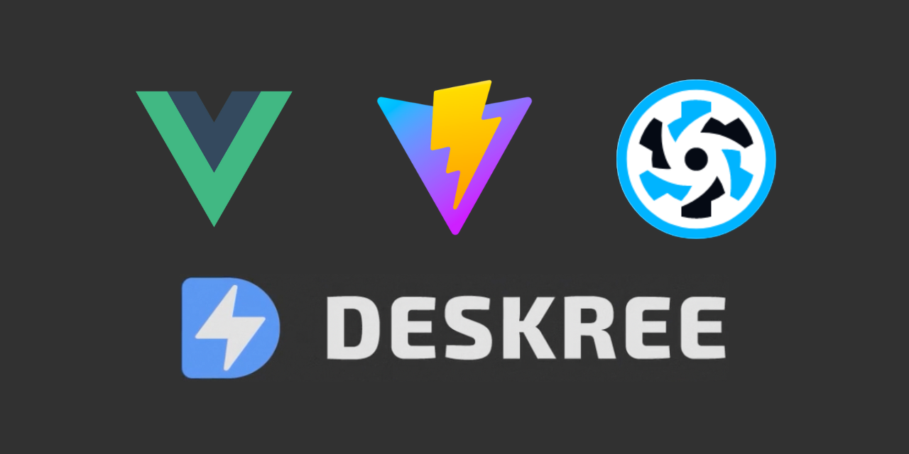

# ⚡ My Notes Deskree (my-notes-deskree)



Um projeto criado com Quasar Framework e back-end sem código gerado pela plataforma [Deskree ⚡](https://www.deskree.com/)

> O Deskree é uma solução de desenvolvimento de back-end sem código baseada na Web que permite que qualquer pessoa crie back-end para qualquer aplicativo em menos de 10 minutos. Configure seu banco de dados, integrações, funções e permissões de usuários, autenticação e muito mais; obtenha sua API pronta para uso para conectá-la ao seu front-end.

Registre-se e teste gratuitamente: https://www.deskree.com/

--- 

## Instalando dependências do projeto Quasar
```bash
yarn
# or
npm install
```

### Iniciando o ambiente de desenvolvimento
```bash
quasar dev
```


### Aplicando Lint nos arquivos
```bash
yarn lint
# or
npm run lint
```


### Gerando a build para produção
```bash
quasar build
```

### Para personalizar suas configurações
Veja o tópico: [Configuring quasar.config.js](https://v2.quasar.dev/quasar-cli-vite/quasar-config-js).
